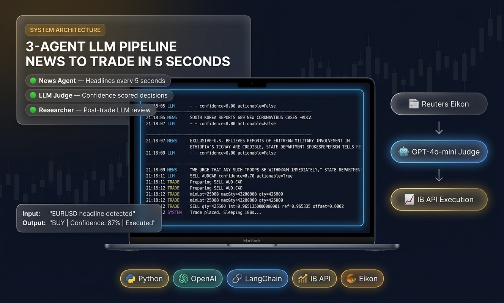
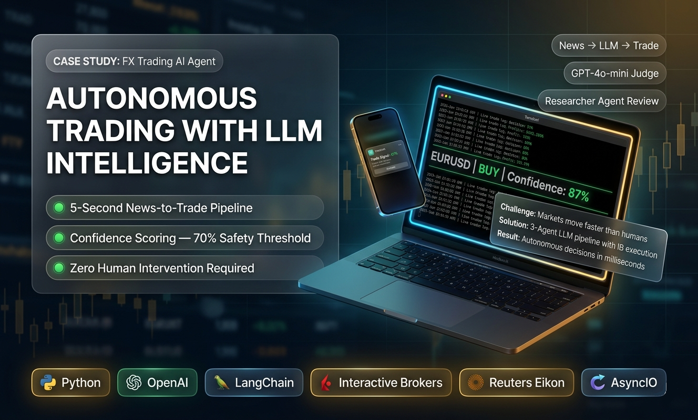

# 📈 FX News Trading Agent

> **Autonomous multi-agent FX trading system** that reads breaking news, researches market impact, and executes forex trades — all without human intervention.

**💰 Sold to a client for $1,000 — actively running in production and generating returns.**

> ⚠️ **Note:** This is a private commercial project. Source code is not publicly available. This repo serves as a portfolio showcase of the architecture and capabilities.

---

## 🧠 What It Does

The system monitors financial news in real-time and autonomously decides whether to trade based on macroeconomic events. Think of it as a team of three specialists working 24/5:

1. **News Reader Agent** — Scans and filters breaking financial news for FX-relevant events
2. **Researcher Agent** — Analyzes the news using LLM reasoning to determine currency pair impact, direction, and confidence
3. **Executor Agent** — Places trades via Interactive Brokers API with risk management guardrails

All three agents are orchestrated by **LangGraph**, creating a stateful pipeline that flows from news → analysis → trade execution.

---

## 🏗️ Architecture Overview

```
┌─────────────────────────────────────────────────────────┐
│                    LangGraph Orchestrator                │
│                                                          │
│  ┌──────────────┐   ┌──────────────┐   ┌──────────────┐ │
│  │  News Reader  │──▶│  Researcher  │──▶│   Executor   │ │
│  │    Agent      │   │    Agent     │   │    Agent     │ │
│  └──────┬───────┘   └──────┬───────┘   └──────┬───────┘ │
│         │                  │                   │         │
│    Fetches &          LLM Reasoning       Places Trades  │
│    Filters News       & Scoring           via IB API     │
│                                                          │
│  ┌────────────────────────────────────────────────────┐  │
│  │              Shared State & Memory                  │  │
│  │  • Trade history  • Confidence scores  • Positions  │  │
│  └────────────────────────────────────────────────────┘  │
└─────────────────────────────────────────────────────────┘
```

---

## ⚙️ Key Features

- **Confidence Gating** — Only executes trades when LLM confidence ≥ 70%, preventing low-conviction entries
- **Margin Validation** — Pre-checks available margin before placing any order
- **Tick-Accurate Pricing** — Rounds to broker-compliant tick sizes for each currency pair
- **Stateful Orchestration** — LangGraph manages agent state across the full pipeline
- **Risk Controls** — Position sizing, stop-loss logic, and exposure limits built in

---

## 🛠️ Tech Stack

| Component | Technology |
|-----------|-----------|
| Agent Framework | LangGraph |
| LLM | GPT-5.4-mini |
| Broker API | Interactive Brokers (IB API / ib_insync) |
| Language | Python |
| Orchestration | Multi-agent state graph |

---

## 📸 Screenshots

### Terminal — Agent Pipeline Running


### Trade Execution Log


> 📌 **To add your screenshots:** Take 1-2 terminal screenshots showing the agent pipeline running (news fetch → analysis → trade), and save them as `screenshots/terminal_run.png` and `screenshots/trade_log.png`.

---

## 📂 Repo Structure

```
fx-news-trading-agent/
├── README.md
├── screenshots/
│   ├── terminal_run.png
│   └── trade_log.png
└── (source code is private)
```

---

## 🚀 Status

- ✅ Sold to a paying client
- ✅ Running in production
- ✅ Actively generating returns
- 🔒 Source code is private (commercial project)

---

## 📬 Contact

**Rana Saad Safdar**
- 💻 [GitHub](https://github.com/Mr-Engnr)

---

*Built with LangGraph, GPT-5.4-mini, and Interactive Brokers API.*